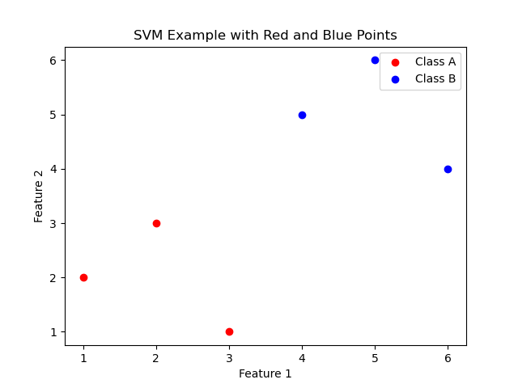
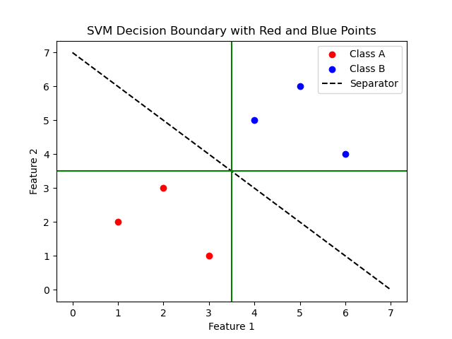
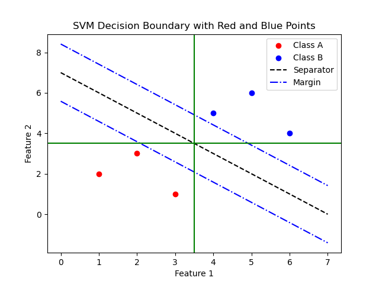

--- 
math: true
---

# 机器学习教程
我期待本书：
多图，少公式

理想情况下，会有配套的ppt或视频教程，不过我觉得，如果书已经足够好了，那些其实都不重要。
## 什么是机器学习

机器学习的本质就是
接下来，我们将演示机器学习的基本过程。它使用决策树预测加州房价数据集。
'''python

'''

## 线性模型
### 线性回归
### 多元线性回归
接下来，我们将使用二元线性模型，进行两个整数加法的演示。
'''python

'''
### 对数线性回归
## 决策树
## 支持向量机
### 一个例子

现在我们有两组数据红点和蓝点($x_1.x_2$)，如下：    
红色点（类别A）: [(1, 2), (2, 3), (3, 1)]   
蓝色点（类别B）: [(4, 5), (5, 6), (6, 4)]   

我们的目标是找到一条直线，使得红色点在直线的一侧，蓝色点在直线的另一侧。很显然，这样的直线有很多。

如果你观察的比较仔细，可以很轻松地发现，$x_2=3.5$和$x_1=3.5$（下图中的绿线）这两条直线都可以很好地将两类点分开。

但是好像并不是很对，因为从直观上看，红点是在左下，蓝点是在右上，它们之间的“最佳“分割线应该是像黑线那样从左上到右下的，而不是绿线那样横平竖直的。但是这只是我们的一种感觉，有没有什么更严谨的方式来描述，到底为什么绿线比黑线差呢？

如果你说”因为绿线离样本近，黑线离样本远“，那么恭喜你，你找到了支持向量机的核心思想，如果你早生几十年你也行。我们很明显可以看出，两条绿色距离它们最近的红点和黑点的距离都是0.5，而黑线离的更远。如果你找出了别的原因，也不要担心，因为你可能会开创一个新的算法。比如如果你找到的是”可以把红点和蓝点求个平均，然后这两个点的垂直平分线就是最佳的线“，这个想法也很棒，可惜也有人想出来了，叫做K-means聚类分析，我们以后会提到的。

回到我们的支持向量机。现在，我们已经明确了，我们需要找到的那条线，它需要满足：离最近的红点和蓝点的距离最大。再严谨一点，设离它最近的红点距离为$d_红$，蓝点距离为$d_蓝$，那么我们的目标是要最大化$min(d_红, d_蓝)$。为什么里面套一层min呢？如果某个线离红点很近，离蓝点很远，那也没有什么意义，比如把黑线往下平移一点到蓝线的位置，如下图所示，蓝线也并不能很好地划分两类点，不是吗？

这里$d_红,d_蓝$如果相等不好吗？这条线凭什么离其中一方近呢？没错，这条线不应该离任何一方近，它应该在两类点的正中间。所以我们令$d_红=d_蓝=d$，这样我们的目标就变成了最大化$d$。在例子中，是(2,3)和(4,5)这两个点，这两个点就叫做**支持向量**。最后我们求出来的直线只和支持向量有关，至于远处的点有多远，有几个，我们都不关心。

设我们要找的那条直线为$w_1x_1 + w_2x_2 + b = 0$，给定一个点$(x_1, x_2)$，（如果你还记得初中数学的点到直线的距离公式的话）它到直线的距离为$\frac{|w_1x_1 + w_2x_2 + b|}{\sqrt{w_1^2 + w_2^2}}$。这条线必须要划分红点和蓝点，而蓝点在上，红点在下，因此对于所有蓝点，有$w_1x_1 + w_2x_2 + b > 0$，对于所有红点，有$w_1x_1 + w_2x_2 + b < 0$。另外还要满足在红点和蓝点的正中间，那么对于两个支持向量（怎么知道哪些是支持向量呢？这个问题很好，我们过一会就来解决），代入后就有$|2w_1+3w_2+b|=|4w_1+5w_2+b|$。我们不妨设$2w_1+3w_2+b=1，4w_1+5w_2+b=-1$。这是因为，上面这个约束条件只有2个，却有3个未知数，是解不出来的。看起来它已经确定了一条线了啊？但是有无数个方程可以描述一条线的。所以我们这就再加一个条件，比如这里就设定$2w_1+3w_2+b=1$。

对于所有蓝点，都有$x_1w_1 + x_2w_2 + b > 1$，所有红点都有$x_1w_1 + x_2w_2 + b < -1$。而对于支持向量，则有$|w_1x_1 + w_2x_2 + b|=1$。我们把支持向量到超平面的距离之和定义为**间隔**。那间隔的公式是什么呢？我们可以把支持向量代入到距离公式中，别忘了我们刚才已经把支持向量代入直线的值设为1了，因此得到$\frac{1}{\sqrt{w_1^2 + w_2^2}}$。

这就是我们的优化目标，我们需要让这个间隔尽可能的大。具体来说，我们要在约束$y_i(w^Tx_i+b) \geq 1$下，最小化$\frac{1}{2}||w||^2$。这个问题可以使用**拉格朗日乘子法**来解决，我们不妨设$L(w,b,\alpha)=\frac{1}{2}||w||^2-\sum_{i=1}^n\alpha_i(y_i(w^Tx_i+b)-1)$。在这个式子中，$\alpha_i$是拉格朗日乘子，是个标量。

根据拉格朗日乘子法，我们要求$L$对$w$和$b$的偏导数为0，即$\frac{\partial L}{\partial w}=w-\sum_{i=1}^n\alpha_iy_ix_i=0$，$\frac{\partial L}{\partial b}=-\sum_{i=1}^n\alpha_iy_i=0$。解这个方程组，我们得到$w=\sum_{i=1}^n\alpha_iy_ix_i$，$\sum_{i=1}^n\alpha_iy_i=0$。代入到$L$中，我们得到$L=\sum_{i=1}^n\alpha_i-\frac{1}{2}\sum_{i=1}^n\sum_{j=1}^n\alpha_i\alpha_jy_iy_jx_i^Tx_j$，约束条件是$\sum_{i=1}^n\alpha_iy_i=0$。我们要求的是这个L的最大值。

可以发现，我们到目前依然不知道哪些向量是我们的支持向量，所以还没法往里面代入值（事实上，如果支持向量确定了，直线也就确定了）

### 核函数

### 软间隔

## 贝叶斯分类器
### 贝叶斯定理
考虑这样一个问题：  
已知：
1. 一般人感冒的概率是0.1
2. 感冒的人发烧的概率是0.8
3. 不感冒的人发烧的概率是0.2    

那么如果我们已知一个人已经发烧了，他感冒的概率是多少？    
对于上面这个问题，我们可以很容易计算出，既感冒又发烧的概率是$0.1*0.8=0.08$，不感冒但发烧的概率是$0.9*0.2=0.18$，这样发烧的概率就是0.08+0.18=0.26，所以发烧的人感冒的概率就是感冒的人占发烧的人的比例，是0.08/0.26=0.308。    
我们设感冒为事件A，发烧为事件B，那么我们把问题转化一下：
P(A) = 0.1, P(B|A) = 0.8, P(B|A') = 0.2，求P(A|B)。     
刚才我们的做法是先求P(A∩B)=P(A)P(B|A)，再求P(B)=P(A)P(B|A)+P(A')P(B|A')，最后求P(A|B)=P(A∩B)/P(B)。     
很可惜，有个叫贝叶斯的人先发现了这件事，因此这个公式不能冠上我们的名字了。      
贝叶斯定理的公式是：$P(A|B)=\frac{P(B|A)P(A)}{P(B)}$。  
这个公式的意义重大！它使得我们可以通过已知”发烧“这个条件，来更新我们对”感冒“的概率。最开始我们只知道感冒的概率是0.1，但是当我们增加了发烧这个条件之后，我们就可以得到感冒的概率是0.308了。我们把P(A)叫做先验概率，P(A|B)叫做后验概率，P(B|A)叫做似然度，P(B)叫做边缘似然度。
### 朴素贝叶斯
好了，那么上面说到的贝叶斯定理，和机器学习有什么关系呢？关系很大！假如现在你拿到一堆样本，只有一个特征：发烧。和一个类别：感冒。现在给你一个发烧的样本，请问这个样本有没有感冒呢？在你已知的样本中，有多少人感冒，感冒的人中有多少发烧的，不感冒的人中有多少发烧的，这些数据很容易得到。那么根据贝叶斯定理，他感冒的概率是0.308，所以我们应该判断这个样本不感冒。
似然概率就是这个特征在某个类别下的概率。

## 降维
为什么要降维？
## 线性代数基础
在机器学习的过程中，会用到许多线性代数的知识，当然，一些朋友可能并没有学过线性代数，或者虽然成功通过了这门课程，但可能还留在脑子的知识只剩下矩阵乘法怎么算了（这种人就是我）。对于这部分不了解线性代数，却依然对机器学习抱有浓厚兴趣的朋友，我们将在本章补充线性代数的相关知识。
### 矩阵

#### 奇异值分解
#### 特征值
## 微积分基础
### 拉格朗日乘子法：
假如现在你想要消费两个产品A和B，它们的价格分别是2元和3元，在消费了x个A和y个B之后，你的效用（可以理解为满足感）是$U(x,y)=x^2y$。你想要用12元买这两个商品，想要最大化你的效用，该怎么办呢？

转换成数学问题就是，在约束条件$2x+3y=12$下，最大化$xy$。

有人说这不简单，把x或y求解一下代入求导不就完了，先解出来$y=\frac{12-2x}{3}$，然后代入$U(x,y)=xy=x\frac{12-2x}{3}$，然后再求导之类的方法得到$U(x,y)$的最大值不就行了。如果你这么想，那么你非常棒，说明你对现有的工具掌握的很好，其实你求导都不用，二次函数求值初中就应该会了。但是我们给约束条件加个平方，比如$2x^2+3y^2=12$，或者再加一个约束$x>y$，让你解不出来，你又该怎么办呢？傻眼了吧。

因为原问题比较简单，我们还是回来原问题解决。但是需要知道的是，拉格朗日乘子法可以求解更一般的问题。我们引入一个新的变量$\lambda$，构造一个新的函数$L(x,y,\lambda)=xy-\lambda(2x+3y-12)$，我们断言：U的极值点一定是L的极值点（但是L的极值点不一定是U的极值点，这个马上你就会看到。至于为什么，如果你非要知道，我们下面会有说明）。

接下来，我们求$L$的偏导数：
$\frac{\partial L}{\partial x}=y-2\lambda=0$，$\frac{\partial L}{\partial y}=x-3\lambda=0$，$\frac{\partial L}{\partial \lambda}=2x+3y-12=0$。解这个方程组，我们得到$x=3,y=2,\lambda=1$。这就是我们可能的极值点。

那么怎么判断这个点到底是不是极值点呢？这需要我们代入验证
## 常用操作
### 卷积
现在考虑这样一种情况：给你一张图片，和一个眼睛。需要你识别出来这个图里有几个眼睛，在哪些地方，你该怎么办呢？    
简化一点，给定一个5*5的布尔矩阵和一个3*3的“模板”，
### 池化
假如给你一个10*10的图片，现在需要你压缩到5*5，你有什么方法吗？